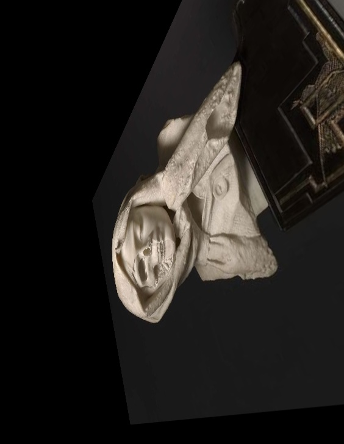

# ASKEW: Perspective transform along specified axes

This is a rewrite of [the original repo](https://github.com/eborboihuc/rotate_3d)

Why a clone and not a fork? I think the original repo is great, and it is a really cool project that I use all the time. That being said, it has too many comments, requires manual changing of parameters every time, and does not support python3. I added proportional rotation for all three axes, and an option to make a gif from the tool, if imagemagick is installed. This was a fairly small change of course, but I also plan to add more image resizing based on the change in perspective (with the original you must calculate the ideal height and width yourself and pass it into the program as an awkward tuple argument).

I would try to fork and make a PR, but it does not look like it is supported currently.

Finally, I added the option to make a GIF with a flag if imagemagick is installed.

## Original Author

Hou-Ning Hu / [@eborboihuc](https://eborboihuc.github.io/)

## Prerequisites

Contrary to what it says on [the original repo](https://github.com/eborboihuc/rotate_3d)

This version is made for:
- Python3 with numpy
- OpenCV
- Imagemagick* if you wish to make a GIF

Unlike the previous version, it should be able to run on any unix system with Python3, and does not require a specific version of OpenCV.

## Usage

```bash
python3 askew.py [-i image_path] [-o outout] [--mode] [--theta] [--phi] [--gamma] [--length] [--width] [--dx] [--dy] [--dz]
```

Example of rotating an image along yz-axis from 0 to 360 degree with a 5 pixel shift in +X direction and making a GIF:

```bash
python3 askew.py -i images/example.jpg -o output --mode multi --phi 360 --gamma 360 --dx 5 -j
```

Single image:

```bash
python3 askew.py -i images/example.jpg --mode single  --theta 120 --gamma 120  --dz 10
```

## Animation


Rotate along YZ axis and translate 5 pixel along X axis



Rotate along XZ axis

## Parameters:

```python
it = ImageTransformer(img_path, height=height, width=width)
it.rotate_along_axis(theta=0, phi=0, gamma=0, dx=0, dy=0, dz=0):
```
- image_path   : the path of image that you want rotated
- output       : name of the output image/gif
- height       : the height of output image, default is original size.
- width        : the width of output image, default is original size.
- theta        : the rotation around the x axis
- phi          : the rotation around the y axis
- gamma        : the rotation around the z axis (basically a 2D rotation)
- dx           : translation along the x axis
- dy           : translation along the y axis
- dz           : translation along the z axis (distance to the image)

## Calculate max height and width

In order to calculate max height and width, as far as I know, we must pre-calculate each degree rotation and

## Acknowledgments

Code ported and modified from [jepson](http://jepsonsblog.blogspot.tw/2012/11/rotation-in-3d-using-opencvs.html) and [stackoverflow](http://stackoverflow.com/questions/17087446/how-to-calculate-perspective-transform-for-opencv-from-rotation-angles). Thanks for their excellent work!
